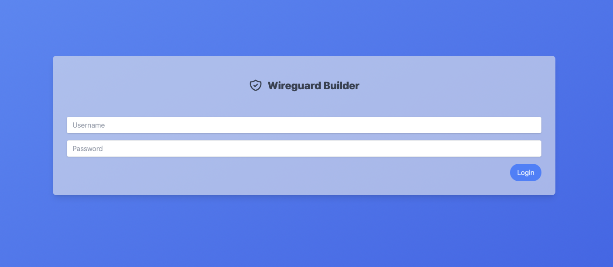

# Wireguard Builder



* [API Documentation](https://mkapra.github.io/wireguard-builder-rs/wireguard_builder_rs/)

## UI

Default login:

* *Username*: `admin`
* *Password*: `&52*xTY$sPW@94*DVu!UHDfZwE7!WCkV`

## Deployment

The supported way to deploy is with the given [docker-compose.yml](docker-compose.yml) file.

1. Change the URL of the API: The API needs to be accessible by each client that needs to access the API.
   The IP or domain name of this API then has to be specified in the docker-compose file as `api_url`. The correct
   definition of this variable is already provided and only needs to be changed to the correct value.

2. Now you can start the stack (docker compose version 2):

    ```bash
    docker compose up -d
    ```

After these steps the Web interface should be accessible on `http://localhost:8080` with the credentials mentioned
above.